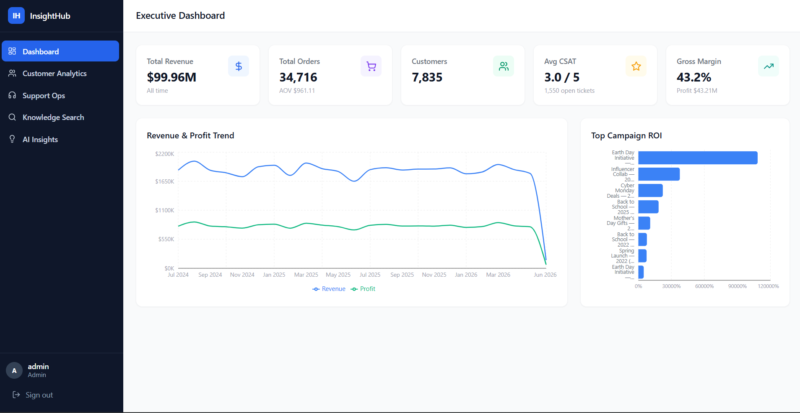
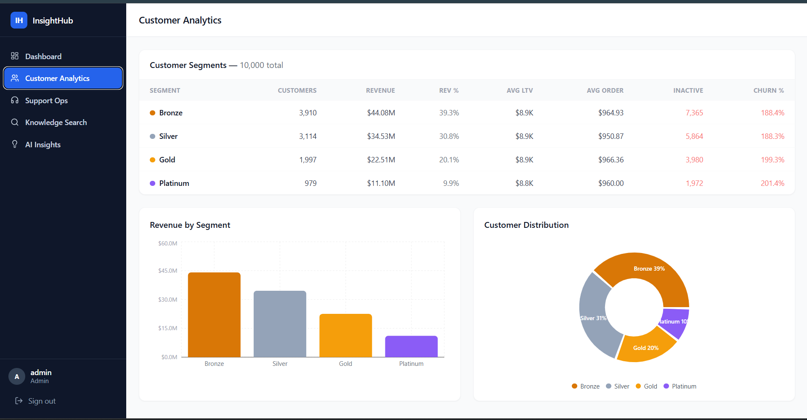
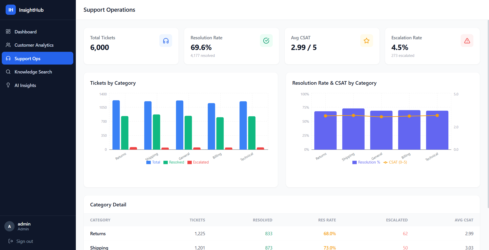
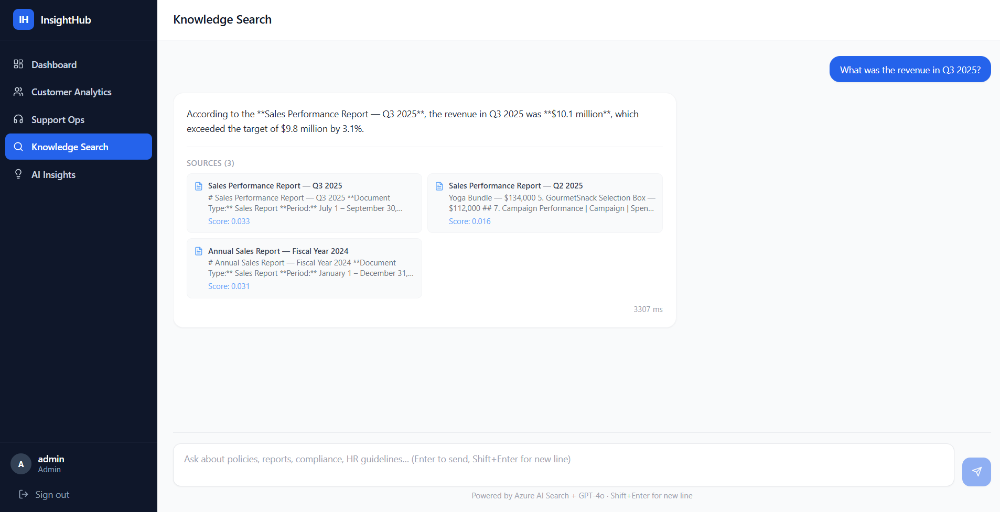
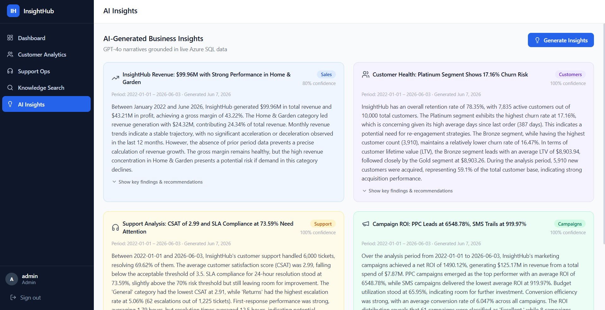
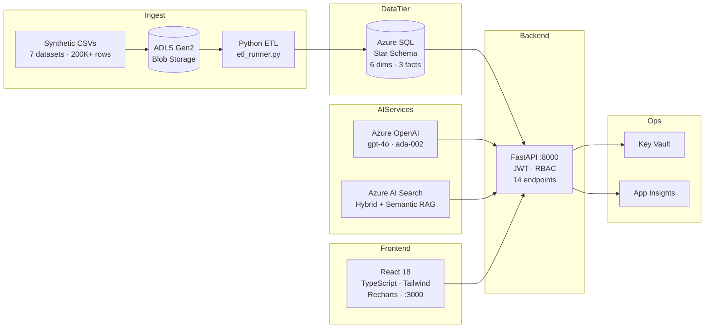

# InsightHub

I built InsightHub as a portfolio project to demonstrate an end-to-end Azure data engineering and analytics stack — starting from raw synthetic data and finishing with a production-grade React dashboard backed by GPT-4o. The goal was to build something I'd actually be proud to show in an interview, not a toy app.

**Stack**: Azure SQL · FastAPI · React 18 · Azure OpenAI (GPT-4o) · Azure AI Search · ADLS Gen2 · Azure Key Vault · Application Insights · Bicep IaC

---

## Live Demo

| Service | URL |
|---------|-----|
| Frontend | _Vercel URL — to be added after deployment_ |
| Backend API | _Azure App Service URL — to be added after deployment_ |
| API Docs (Swagger) | `<backend-url>/docs` |

**Demo credentials** (no sign-up required):

| Username | Password | Role | What you can see |
|----------|----------|------|-----------------|
| `admin` | `InsightHub@Admin2024!` | Admin | Everything including AI Insights generation |
| `analyst` | `InsightHub@Analyst2024!` | Analyst | Dashboard · Customers · Support · Knowledge Search |
| `viewer` | `InsightHub@Viewer2024!` | Viewer | Executive Dashboard · AI Insights (read-only) |

**Backend offline?** Click "Explore as Guest" on the login page to see the full UI with sample data — no backend needed.

---

## Screenshots

| Page | Description |
|------|-------------|
|  | Executive Dashboard — KPI cards, revenue trend, campaign ROI |
|  | Customer Analytics — segment breakdown, revenue by segment |
|  | Support Operations — ticket volume, resolution times, CSAT |
|  | Knowledge Search — RAG-powered natural language Q&A |
|  | AI Insights — GPT-4o generated findings per category |

> See [docs/screenshots/README.md](docs/screenshots/README.md) for capture instructions.

---

## What I Built and Why

### The problem I was solving
I wanted to see if I could build something that a real business could actually use — not just a CRUD app or a tutorial project. So I designed a full analytics platform: raw data goes into Azure Blob Storage, gets transformed and loaded into a star schema SQL database, and surfaces through a FastAPI backend to a React dashboard. Then I added an AI layer on top using Azure AI Search and GPT-4o.

### Why a star schema?
I chose a star schema (6 dimensions, 3 fact tables) over a normalized relational design because the dashboard queries need to aggregate across multiple dimensions simultaneously — revenue by product *and* region *and* date in a single query. The star schema makes those joins fast and obvious. I also added a Non-Clustered Columnstore Index on FactSales, which cut aggregate query time from ~8 seconds to under 1 second on 119K rows.

### Why hybrid search?
Pure vector search is great for semantic similarity but it fails on exact factual questions like "what was Q3 2025 revenue?" I implemented hybrid search — BM25 keyword scoring combined with ada-002 vector embeddings, then Azure AI Search's semantic re-ranker does a final pass. This handles both "find something that means X" and "find the document with this exact number" queries correctly.

### Why FastAPI over Django or Flask?
FastAPI generates OpenAPI docs automatically, which is genuinely useful when you're building a frontend against the backend. The dependency injection pattern for JWT authentication is also clean — one `Depends(_viewer)` decorator on a route and the auth layer is fully wired. I'd used Flask before; FastAPI is noticeably more productive for API-only backends.

---

## Architecture



---

## Project Structure

```
insighthub/
├── .env                          # All secrets (never commit)
├── .env.example                  # Template — copy and fill in
├── README.md
├── CLAUDE.md                     # Phase status & known issues
│
├── backend/
│   ├── requirements.txt
│   └── app/
│       ├── main.py               # FastAPI app factory, middleware, lifespan
│       ├── api/                  # Route handlers (auth, metrics, search, insights, powerbi)
│       ├── core/                 # Config, DB, security, App Insights, Key Vault
│       ├── models/               # Pydantic schemas (request + response)
│       └── services/             # Business logic (metrics, auth, RAG, insights)
│
├── frontend/
│   ├── package.json              # React 18 + Vite + Tailwind + Recharts
│   ├── vite.config.ts            # Port 3000, allowedHosts: true
│   └── src/
│       ├── api/                  # Axios client + typed wrappers per endpoint
│       ├── contexts/             # AuthContext (JWT + RBAC + guest mode)
│       ├── lib/                  # guestData.ts — mock data for offline demo
│       ├── components/           # AppLayout, Sidebar, KPICard, LoadingSpinner
│       ├── pages/                # LoginPage, ExecutiveDashboard, CustomerAnalytics…
│       ├── types/                # TypeScript interfaces matching Pydantic schemas
│       └── utils/                # formatCurrency, formatPct, formatDate
│
├── database/
│   ├── schema/                   # 01_dimensions.sql through 07_insights.sql
│   └── seed_users.py             # Seeds 3 demo accounts with bcrypt passwords
│
├── etl-pipelines/python-local/
│   ├── etl_runner.py             # Main orchestrator (--full-reload flag)
│   ├── blob_reader.py            # Azure Blob CSV download
│   ├── transformers.py           # Data transformations + key lookups
│   ├── loaders.py                # SQL MERGE (dims) + INSERT (facts)
│   └── watermark.py              # Incremental load tracking
│
├── ai-search/
│   ├── documents/                # 20 internal business documents (.md)
│   ├── rag-pipeline/             # Chunker, embeddings, indexer, searcher, RAG
│   └── run_indexer.py            # Build the AI Search index (run once)
│
├── docs/
│   ├── DECISIONS.md              # Key technical decisions and the reasoning behind them
│   ├── security/                 # security-architecture.md, owasp-checklist.md
│   ├── architecture/             # system-design.md
│   ├── powerbi/                  # powerbi-design.md
│   └── screenshots/              # README.md + PNG captures
│
└── infra/
    ├── main.bicep                # All 13 Azure resources as code
    └── parameters.json           # Key Vault reference for SQL password
```

---

## Prerequisites

| Tool | Version | Notes |
|------|---------|-------|
| Python | 3.10+ | Anaconda recommended |
| Node.js | 18+ | npm 9+ |
| ODBC Driver 18 | for SQL Server | [Download](https://learn.microsoft.com/en-us/sql/connect/odbc/download-odbc-driver-for-sql-server) |
| Azure CLI | Latest | `az login` required for Bicep deploy |

**Azure resources you'll need:**
- Azure SQL Database (S2 SKU or higher)
- Azure Blob Storage (ADLS Gen2 enabled)
- Azure OpenAI (gpt-4o + text-embedding-ada-002 deployments)
- Azure AI Search (Basic SKU)
- Application Insights + Log Analytics (optional but recommended)
- Azure Key Vault (optional for local dev, required for production)

---

## Quick Start

### 1. Clone and configure

```bash
git clone https://github.com/Phani465/insighthub.git
cd insighthub
cp .env.example .env   # Fill in your Azure resource credentials
```

Key `.env` variables:

```env
DB_SERVER=your-server.database.windows.net
DB_NAME=insighthub-db
DB_USER=your-sql-user
DB_PASSWORD=your-sql-password
JWT_SECRET_KEY=<run: python -c "import secrets; print(secrets.token_hex(32))">
AZURE_OPENAI_ENDPOINT=https://your-resource.openai.azure.com/
AZURE_OPENAI_KEY=your-key
AZURE_OPENAI_DEPLOYMENT=gpt-4o
AZURE_OPENAI_EMBEDDING_DEPLOYMENT=text-embedding-ada-002
AZURE_SEARCH_ENDPOINT=https://your-search.search.windows.net
AZURE_SEARCH_KEY=your-key
AZURE_SEARCH_INDEX=insighthub-docs
ALLOWED_ORIGINS=http://localhost:3000
```

### 2. Deploy Azure infrastructure (Bicep)

```bash
az group create --name rg-insighthub-devphani --location eastus

az deployment group create \
  --resource-group rg-insighthub-devphani \
  --template-file infra/main.bicep \
  --parameters @infra/parameters.json
```

### 3. Deploy database schema

```bash
for i in 01 02 03 04 05 06 07; do
  sqlcmd -S $DB_SERVER -d $DB_NAME -U $DB_USER -P $DB_PASSWORD \
    -i database/schema/${i}*.sql
done

python database/seed_users.py
```

### 4. Run ETL pipeline

```bash
python etl-pipelines/python-local/etl_runner.py --full-reload
```

Expected row counts: DimDate 5,113 · DimCustomer 10,000 · DimProduct 500 · FactSales 119,652+ · FactSupportTickets 20,000 · FactCampaignPerformance 100.

### 5. Build AI Search index

```bash
python ai-search/run_indexer.py
```

This chunks 20 internal documents, embeds them with ada-002, and uploads to the `insighthub-docs` index. Only needs to be run once.

### 6. Start backend

```bash
cd backend
python -m uvicorn app.main:app --host 0.0.0.0 --port 8000 --reload
```

Health check: `curl http://localhost:8000/api/health` → `{"status":"healthy","database":"connected"}`

### 7. Start frontend

```bash
cd frontend
npm install
npm run dev
```

Open http://localhost:3000

### 8. Generate AI Insights (first run, admin only)

```bash
TOKEN=$(curl -s -X POST http://localhost:8000/api/auth/token \
  -H "Content-Type: application/json" \
  -d '{"username":"admin","password":"InsightHub@Admin2024!"}' \
  | python -c "import sys,json; print(json.load(sys.stdin)['access_token'])")

curl -X POST http://localhost:8000/api/insights/generate \
  -H "Authorization: Bearer $TOKEN" \
  -H "Content-Type: application/json" \
  -d '{"categories":["Sales","Customers","Support","Campaigns"]}'
```

Or just log in as admin in the browser and click **Generate Insights** on the AI Insights page.

---

## Demo Credentials

| Username | Password | Role | Pages Accessible |
|----------|----------|------|-----------------|
| `admin` | `InsightHub@Admin2024!` | Admin | All + Generate Insights |
| `analyst` | `InsightHub@Analyst2024!` | Analyst | Dashboard · Customers · Support · Search |
| `viewer` | `InsightHub@Viewer2024!` | Viewer | Dashboard · Insights |

---

## API Reference

| Method | Path | Auth | Description |
|--------|------|------|-------------|
| `POST` | `/api/auth/token` | Public | Login → JWT access + refresh token |
| `POST` | `/api/auth/refresh` | Public | Rotate expired access token |
| `GET` | `/api/auth/me` | Any JWT | Current user profile |
| `GET` | `/api/metrics/dashboard` | Viewer+ | KPI cards aggregate |
| `GET` | `/api/metrics/revenue` | Viewer+ | Revenue trend (day/week/month/quarter/year) |
| `GET` | `/api/metrics/campaigns` | Viewer+ | Campaign ROI table |
| `GET` | `/api/metrics/customers` | Analyst+ | Customer segment breakdown |
| `GET` | `/api/metrics/products` | Analyst+ | Product performance |
| `GET` | `/api/metrics/support` | Analyst+ | Support ticket KPIs |
| `POST` | `/api/search` | Analyst+ | RAG natural-language search |
| `GET` | `/api/insights` | Viewer+ | List AI-generated insights |
| `GET` | `/api/insights/{id}` | Viewer+ | Full insight with structured JSON |
| `POST` | `/api/insights/generate` | Admin | Trigger GPT-4o insight generation |
| `GET` | `/api/health` | Public | Health check + DB connectivity |

Full interactive docs: http://localhost:8000/docs

---

## What I Learned

1. **Columnstore indexes are genuinely transformative for analytics workloads.** One `CREATE NONCLUSTERED COLUMNSTORE INDEX` statement on FactSales took my dashboard aggregate query from 8 seconds to under 1 second. I'd read about this but seeing it in practice made it real.

2. **Type mismatches between Python and SQL are silent killers.** The `fast_executemany` bug that padded empty strings with spaces cost me two hours of debugging — the data *looked* correct in SSMS but the Python lookup was comparing `''` against `'  '`. I now always print raw bytes when a lookup that should match doesn't.

3. **Hybrid search is meaningfully better than pure vector search for factual Q&A.** Pure vector search finds semantically similar documents but misses exact terms. Adding BM25 alongside the vector scores made the knowledge search actually useful for precise questions like "what is the expense limit for hotel bookings?"

4. **Vite environment variables have a footgun**: the string `'all'` is silently ignored for `allowedHosts` — only the boolean `true` works. I learned this the hard way after spending 30 minutes wondering why my Vercel deployment was still blocked after setting `allowedHosts: 'all'`.

5. **JWT in localStorage is fine for demos, not for production.** I used `localStorage` for token storage because it's simple and works everywhere. In production I'd use `httpOnly` cookies instead — they're invisible to JavaScript and immune to XSS. It's the kind of shortcut that's easy to justify during initial development and hard to fix later.

---

## Phase Completion

| Phase | Description | Status |
|-------|-------------|--------|
| 1 | Synthetic data (7 CSV files, 200K+ rows) + Azure Blob upload | ✅ |
| 2 | Azure SQL star schema (9 tables, 5 views, 15 indexes) | ✅ |
| 3 | Python ETL pipeline with watermark incremental loads | ✅ |
| 4 | FastAPI backend — JWT, RBAC, 14 endpoints | ✅ |
| 5 | Power BI Embedded — design complete, license required to activate | ⏳ |
| 6 | Azure AI Search + RAG pipeline (hybrid + semantic) | ✅ |
| 7 | AI Insights Engine — GPT-4o with structured JSON output | ✅ |
| 8 | React 18 TypeScript frontend — 6 pages, guest mode | ✅ |
| 9 | Security docs + OWASP audit + Application Insights custom events | ✅ |
| 10 | Architecture docs + Bicep IaC + deployment prep | ✅ |

---

## Power BI Embedded — Design Complete

The full Power BI Embedded integration uses the **App-Owns-Data** pattern — a service principal authenticates via MSAL client-credentials, exchanges for an Azure AD token, then calls the Power BI REST API to generate a short-lived embed token. Report access is entirely server-side; no user credentials ever reach the browser.

**Already implemented in this repo:**
- `backend/app/api/powerbi.py` — embed token endpoint (Admin-only JWT guard)
- `config.py` — `powerbi_client_id`, `powerbi_client_secret`, `powerbi_workspace_id`, `powerbi_report_id` settings
- `keyvault.py` — Key Vault secret mapping for the client secret
- 12 DAX measures designed across Revenue, Customer LTV, Support SLA, and Campaign ROI
- Row Level Security with `USERNAME()` identity injection
- Ready-to-use `PowerBIEmbed` React component

**To activate:** Needs a Power BI Pro license or Premium Per User (PPU) capacity.

See [docs/powerbi/powerbi-design.md](docs/powerbi/powerbi-design.md) for the full design, DAX measures, and 8-step activation guide.

---

## Known Issues

| Issue | Impact | Fix |
|-------|--------|-----|
| FactSales ~30K rows have NULL GeographyKey | ~20% rows excluded from geo analytics | Re-run ETL with `--full-reload` |
| ETL full reload takes 2–3 hours | Dev inconvenience | Use targeted scripts for individual entities |
| No rate limiting on `/api/auth/token` | Brute-force possible | Add SlowAPI or Azure APIM |
| Insight generation is synchronous (~60s) | Long admin HTTP request | Move to background queue for production |

---

## Deployment

### Frontend — Vercel

**GitHub integration (easiest):**

1. Push this repo to GitHub
2. Go to [vercel.com](https://vercel.com) → **New Project** → import the repo
3. Set **Root Directory** to `frontend`
4. Add environment variable: `VITE_API_URL = https://<your-backend>.azurewebsites.net`
5. Click **Deploy**

**Vercel CLI:**

```bash
cd frontend
echo "VITE_API_URL=https://<your-backend>.azurewebsites.net" > .env.production
npm install -g vercel
vercel --prod
```

After deploy, update `ALLOWED_ORIGINS` in App Service settings to the Vercel URL.

---

### Backend — Azure App Service

```bash
RG=rg-insighthub-devphani
APP=insighthub-dev-api
PLAN=insighthub-dev-plan

# Create resources
az appservice plan create --name $PLAN --resource-group $RG --sku B2 --is-linux
az webapp create --name $APP --resource-group $RG --plan $PLAN --runtime "PYTHON:3.11"

# Set startup command
az webapp config set --name $APP --resource-group $RG --startup-file "startup.sh"

# Configure environment variables
az webapp config appsettings set --name $APP --resource-group $RG --settings \
    DB_SERVER="insighthub-sql-phani01.database.windows.net" \
    DB_NAME="insighthub-db" \
    DB_USER="<sql-user>" \
    DB_PASSWORD="<sql-password>" \
    JWT_SECRET_KEY="<openssl rand -hex 32>" \
    AZURE_OPENAI_ENDPOINT="https://<your-openai>.openai.azure.com/" \
    AZURE_OPENAI_KEY="<key>" \
    AZURE_OPENAI_DEPLOYMENT="gpt-4o" \
    AZURE_OPENAI_EMBEDDING_DEPLOYMENT="text-embedding-ada-002" \
    AZURE_SEARCH_ENDPOINT="https://<your-search>.search.windows.net" \
    AZURE_SEARCH_KEY="<key>" \
    AZURE_SEARCH_INDEX="insighthub-docs" \
    ALLOWED_ORIGINS="https://<your-app>.vercel.app" \
    APPLICATIONINSIGHTS_CONNECTION_STRING="<from portal>" \
    SCM_DO_BUILD_DURING_DEPLOYMENT="true" \
    WEBSITES_PORT="8000"

# Deploy code
cd backend
zip -r ../insighthub-backend.zip . --exclude "*.pyc" --exclude "__pycache__/*" --exclude ".env"
cd ..
az webapp deployment source config-zip --name $APP --resource-group $RG --src insighthub-backend.zip

# Verify
curl https://$APP.azurewebsites.net/api/health
```

---

## Further Reading

- [Technical Decisions](docs/DECISIONS.md) — The reasoning behind key architecture choices, in plain English
- [Security Architecture](docs/security/security-architecture.md) — Defense in depth, Key Vault, Managed Identity, KQL alerts
- [OWASP Checklist](docs/security/owasp-checklist.md) — Every endpoint audited against OWASP Top 10
- [System Design](docs/architecture/system-design.md) — Component design, data flow, technology decisions
- [Power BI Design](docs/powerbi/powerbi-design.md) — App-Owns-Data embedding, DAX measures, RLS, activation guide
