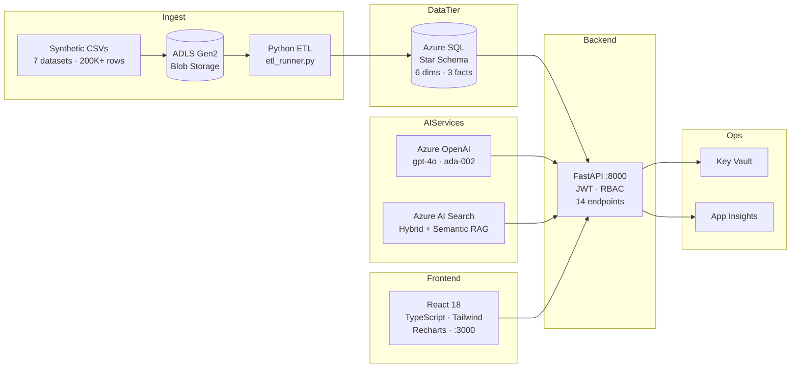

# InsightHub

End-to-end Azure analytics platform — synthetic data to executive dashboard in 10 phases.

**Stack**: Azure SQL · FastAPI · React 18 · Azure OpenAI (GPT-4o) · Azure AI Search · ADLS Gen2 · Azure Key Vault · Application Insights · Bicep IaC

---

## Architecture



---

## Project Structure

```
insighthub/
├── .env                          # All secrets (never commit)
├── README.md
├── CLAUDE.md                     # Phase status & known issues
│
├── backend/
│   ├── requirements.txt
│   └── app/
│       ├── main.py               # FastAPI app factory, middleware, lifespan
│       ├── api/                  # Route handlers (auth, metrics, search, insights, powerbi)
│       ├── core/                 # Config, DB, security, App Insights, Key Vault
│       ├── models/               # Pydantic schemas (request + response)
│       └── services/             # Business logic (metrics, auth, RAG, insights)
│
├── frontend/
│   ├── package.json              # React 18 + Vite + Tailwind + Recharts
│   ├── vite.config.ts            # Port 3000, strict
│   └── src/
│       ├── api/                  # Axios client + typed wrappers per endpoint
│       ├── contexts/             # AuthContext (JWT + RBAC)
│       ├── components/           # AppLayout, Sidebar, KPICard, LoadingSpinner
│       ├── pages/                # LoginPage, ExecutiveDashboard, CustomerAnalytics…
│       ├── types/                # TypeScript interfaces matching Pydantic schemas
│       └── utils/                # formatCurrency, formatPct, formatDate
│
├── database/
│   ├── schema/                   # 01_dimensions.sql through 07_insights.sql
│   └── seed_users.py             # Seeds 3 demo accounts with bcrypt passwords
│
├── etl-pipelines/python-local/
│   ├── etl_runner.py             # Main orchestrator (--full-reload flag)
│   ├── blob_reader.py            # Azure Blob CSV download
│   ├── validators.py             # Input schema validation
│   ├── transformers.py           # Data transformations + key lookups
│   ├── loaders.py                # SQL MERGE (dims) + INSERT (facts)
│   └── watermark.py              # Incremental load tracking
│
├── ai-search/
│   ├── documents/                # 20 internal business documents (.md)
│   ├── rag-pipeline/             # Chunker, embeddings, indexer, searcher, RAG
│   └── run_indexer.py            # Build the AI Search index (run once)
│
├── docs/
│   ├── security/
│   │   ├── security-architecture.md
│   │   └── owasp-checklist.md
│   ├── architecture/
│   │   └── system-design.md
│   └── interview/
│       └── interview-qa.md
│
└── infra/
    ├── main.bicep                # All Azure resources as code
    └── parameters.json           # Environment-specific values
```

---

## Prerequisites

| Tool | Version | Notes |
|------|---------|-------|
| Python | 3.10+ | Anaconda recommended |
| Node.js | 18+ | npm 9+ |
| ODBC Driver 18 | for SQL Server | [Download](https://learn.microsoft.com/en-us/sql/connect/odbc/download-odbc-driver-for-sql-server) |
| Azure CLI | Latest | `az login` required for Bicep deploy |

**Azure Resources required:**
- Azure SQL Database (S2 SKU)
- Azure Blob Storage account (ADLS Gen2 enabled)
- Azure OpenAI (gpt-4o + text-embedding-ada-002 deployments)
- Azure AI Search (Basic SKU)
- Application Insights + Log Analytics Workspace (optional)
- Azure Key Vault (optional — for production secret management)

---

## Quick Start

### 1. Clone and configure

```bash
git clone https://github.com/Phani465/insighthub.git
cd insighthub
cp .env.example .env   # Edit with your Azure resource credentials
```

Key `.env` variables:

```env
DB_SERVER=insighthub-sql-phani01.database.windows.net
DB_NAME=insighthub-db
DB_USER=your_sql_user
DB_PASSWORD=your_sql_password
JWT_SECRET_KEY=<openssl rand -hex 32>
AZURE_OPENAI_ENDPOINT=https://your-resource.openai.azure.com/
AZURE_OPENAI_KEY=your_key
AZURE_OPENAI_DEPLOYMENT=gpt-4o
AZURE_OPENAI_EMBEDDING_DEPLOYMENT=text-embedding-ada-002
AZURE_SEARCH_ENDPOINT=https://your-search.search.windows.net
AZURE_SEARCH_KEY=your_key
AZURE_SEARCH_INDEX=insighthub-docs
ALLOWED_ORIGINS=http://localhost:3000
```

### 2. Deploy Azure infrastructure (Bicep)

```bash
az group create --name rg-insighthub-devphani --location eastus

az deployment group create \
  --resource-group rg-insighthub-devphani \
  --template-file infra/main.bicep \
  --parameters @infra/parameters.json
```

### 3. Deploy database schema

```bash
# Run SQL scripts in order against Azure SQL
for i in 01 02 03 04 05 06 07; do
  sqlcmd -S $DB_SERVER -d $DB_NAME -U $DB_USER -P $DB_PASSWORD \
    -i database/schema/${i}*.sql
done

# Seed demo users
python database/seed_users.py
```

### 4. Run ETL pipeline (full load)

```bash
python etl-pipelines/python-local/etl_runner.py --full-reload
```

Expected row counts after full load: DimDate 5,113 · DimCustomer 10,000 · DimProduct 500 · FactSales 119,652+ · FactSupportTickets 20,000 · FactCampaignPerformance 100.

### 5. Build AI Search index

```bash
python ai-search/run_indexer.py
```

Chunks 20 internal documents, embeds with ada-002, uploads to `insighthub-docs` index.

### 6. Start backend

```bash
cd backend
python -m uvicorn app.main:app --host 0.0.0.0 --port 8000 --reload
```

Verify: `curl http://localhost:8000/api/health` → `{"status":"healthy","database":"connected"}`

### 7. Start frontend

```bash
cd frontend
npm install
npm run dev
```

Open http://localhost:3000

### 8. Generate AI Insights (first run)

Log in as admin in the browser, navigate to **AI Insights**, and click **Generate Insights**.

Or via curl:
```bash
TOKEN=$(curl -s -X POST http://localhost:8000/api/auth/token \
  -H "Content-Type: application/json" \
  -d '{"username":"admin","password":"InsightHub@Admin2024!"}' | python -c "import sys,json; print(json.load(sys.stdin)['access_token'])")

curl -X POST http://localhost:8000/api/insights/generate \
  -H "Authorization: Bearer $TOKEN" \
  -H "Content-Type: application/json" \
  -d '{"categories":["Sales","Customers","Support","Campaigns"]}'
```

---

## Demo Credentials

| Username | Password                  | Role    | Pages Accessible |
|----------|---------------------------|---------|-----------------|
| `admin`    | `InsightHub@Admin2024!`   | Admin   | All + Generate Insights |
| `analyst`  | `InsightHub@Analyst2024!` | Analyst | Dashboard · Customers · Support · Search |
| `viewer`   | `InsightHub@Viewer2024!`  | Viewer  | Dashboard · Insights |

---

## API Reference

| Method | Path | Auth | Description |
|--------|------|------|-------------|
| `POST` | `/api/auth/token` | Public | Login → access token + refresh token |
| `POST` | `/api/auth/refresh` | Public | Rotate expired access token |
| `GET` | `/api/auth/me` | Any JWT | Current user profile |
| `GET` | `/api/metrics/dashboard` | Viewer+ | Aggregate KPI cards |
| `GET` | `/api/metrics/revenue` | Viewer+ | Revenue trend (granularity: day/week/month/quarter/year) |
| `GET` | `/api/metrics/campaigns` | Viewer+ | Campaign ROI table |
| `GET` | `/api/metrics/customers` | Analyst+ | Customer segment breakdown |
| `GET` | `/api/metrics/products` | Analyst+ | Product performance table |
| `GET` | `/api/metrics/support` | Analyst+ | Support ticket KPIs |
| `POST` | `/api/search` | Analyst+ | RAG natural-language search |
| `GET` | `/api/insights` | Viewer+ | List AI-generated insights |
| `GET` | `/api/insights/{id}` | Viewer+ | Full insight with structured JSON |
| `POST` | `/api/insights/generate` | Admin | Trigger GPT-4o insight generation |
| `GET` | `/api/health` | Public | Health check + DB connectivity |

Full interactive docs: http://localhost:8000/docs

---

## Phase Completion

| Phase | Description | Status |
|-------|-------------|--------|
| 1 | Synthetic data (7 CSV files, 200K+ rows) + Azure Blob upload | ✅ |
| 2 | Azure SQL star schema (9 tables, 5 views, 15 indexes) | ✅ |
| 3 | Python ETL pipeline with watermark incremental loads | ✅ |
| 4 | FastAPI backend — JWT, RBAC, 14 endpoints | ✅ |
| 5 | Power BI Embedded | ⏳ Skipped |
| 6 | Azure AI Search + RAG pipeline (hybrid + semantic) | ✅ |
| 7 | AI Insights Engine — GPT-4o with structured JSON output | ✅ |
| 8 | React 18 TypeScript frontend — 6 pages, Recharts | ✅ |
| 9 | Security docs + OWASP audit + Application Insights custom events | ✅ |
| 10 | README + Architecture + Bicep IaC + Interview Q&A | ✅ |

---

## Known Issues

| Issue | Impact | Fix |
|-------|--------|-----|
| FactSales ~30K rows have NULL GeographyKey (StateCode padding bug) | ~20% rows excluded from geo analytics | Re-run ETL with `--full-reload` |
| ETL full reload takes 2–3 hours | Dev inconvenience | Targeted reload scripts (e.g. `load_campaigns_only.py`) |
| No rate limiting on `/api/auth/token` | Brute-force possible | Add SlowAPI or Azure APIM rate limiting |
| Insight generation is synchronous (~60s for all 4 categories) | Long admin HTTP request | Move to background queue for production |

---

## Further Reading

- [Security Architecture](docs/security/security-architecture.md) — Defense in depth, Key Vault, Managed Identity, RBAC roles
- [OWASP Checklist](docs/security/owasp-checklist.md) — Every endpoint audited against OWASP Top 10
- [System Design](docs/architecture/system-design.md) — Component design, data flow, technology decisions
- [Interview Q&A](docs/interview/interview-qa.md) — 60+ questions and answers covering all phases
