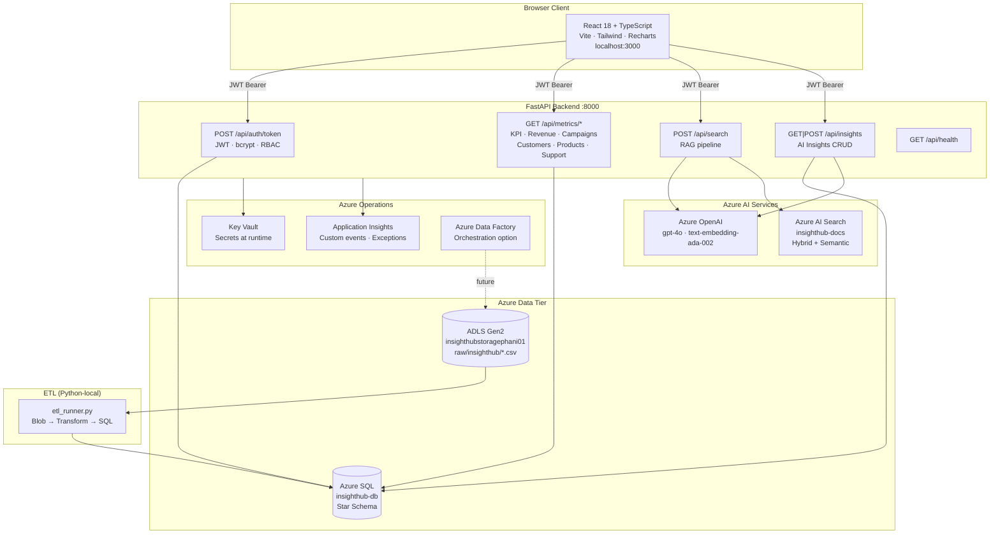

# InsightHub — System Design

## Problem Statement

Build an end-to-end cloud analytics platform that:
1. Ingests synthetic business data (customers, orders, products, campaigns, support tickets)
2. Stores it in a queryable star schema optimised for analytical workloads
3. Exposes aggregated metrics via a secured REST API
4. Answers natural-language questions against an internal knowledge base (RAG)
5. Generates GPT-4o business narratives from live database metrics
6. Presents all of the above in a role-gated web dashboard

---

## Architecture Diagram



---

## Component Design

### 1. Data Layer — Azure SQL Star Schema

**Why a star schema?**

Star schemas separate facts (measurable events) from dimensions (descriptive context). This design enables slice-and-dice analytics with single-table scans on fact tables and small lookups on dimensions — critical for Azure SQL S2 which has limited DTUs.

**Schema overview:**

```
DimDate          ← Date intelligence (FY, quarter, week, holiday flags)
DimGeography     ← 50K normalised city/state/country rows
DimCustomer      ← 10K customers with segment, LTV, account status
DimProduct       ← 500 products with category, brand, margin data
DimEmployee      ← 200 employees with department and hire date
DimCampaign      ← 100 marketing campaigns with type and budget
AppUsers         ← 3 authentication accounts (bcrypt hashed passwords)
AIInsights       ← Generated GPT-4o insight records (UNIQUEIDENTIFIER PK)

FactSales              ← 119,652 order-item level rows (grain: one row per line item)
FactSupportTickets     ← 20K support tickets with CSAT and resolution metrics
FactCampaignPerformance ← 100 campaign KPIs (impressions, clicks, conversions, ROI)
```

**Key design decisions:**

| Decision | Rationale |
|----------|-----------|
| `DimDate.DateKey` as INT (YYYYMMDD) | Industry standard; avoids DATE comparison overhead; enables year/month arithmetic via integer math |
| Non-clustered columnstore index on `FactSales` | Compresses repetitive numeric columns 5–10×; enables batch-mode execution for aggregation queries; critical for the 119K-row table on S2 DTU budget |
| Views (`vw_SalesSummary`, `vw_CampaignROI`, `vw_SupportMetrics`, `vw_ProductPerformance`) | Encapsulate multi-table JOINs; backend queries views not base tables, decoupling API from schema changes |
| `DimGeography.StateCode` normalised with `.strip()` | Fixed ETL bug where `fast_executemany` padded empty strings with spaces |
| `FactSales` grain at order-item level | Preserves line-item detail for product-level analytics without requiring a separate FactOrderItems table |

**Reporting views:**

```sql
-- vw_SalesSummary: FactSales ⋈ DimDate ⋈ DimCustomer ⋈ DimProduct ⋈ DimGeography
-- Adds: MonthYear, CalendarYear, QuarterLabel, WeekOfYear, CustomerSegment,
--       ProductCategory, ProductBrand, GrossRevenue, GrossProfit, OrderStatus

-- vw_CampaignROI: FactCampaignPerformance ⋈ DimCampaign ⋈ DimDate
-- Adds: ROI_Pct, CTR_Pct, ConversionRate_Pct, ROI_Band (Excellent/Good/Break-Even/Loss)

-- vw_SupportMetrics: FactSupportTickets ⋈ DimDate ⋈ DimCustomer ⋈ DimEmployee
-- Adds: CreatedMonthYear, SLA24h_CompliancePct, resolution rates by category and priority

-- vw_ProductPerformance: DimProduct ⋈ FactSales aggregated
-- Adds: TotalUnitsSold, TotalRevenue, CurrentMarginPct, NeedsReorder flag
```

---

### 2. ETL Pipeline

**Architecture:**

```
Azure Blob Storage (CSV)
         │
         ▼  blob_reader.py (downloads via BlobServiceClient)
    Raw DataFrame
         │
         ▼  validators.py (schema checks, type coercion, null handling)
    Validated DataFrame
         │
         ▼  transformers.py (key lookups, date conversions, derived columns)
    Fact/Dim DataFrames
         │
         ▼  loaders.py (MERGE for dims, VALUES INSERT for facts)
    Azure SQL Star Schema
```

**Watermark pattern (incremental loads):**

```python
# watermark.py stores last successful load timestamp per entity
# Incremental: WHERE modified_date > last_watermark
# Full reload:  --full-reload flag bypasses watermark
```

**Key ETL bugs fixed (documented for interview):**

| Bug | Root Cause | Fix |
|-----|-----------|-----|
| Error 8114 (type inference) | `fast_executemany` inferred wrong type from first row | Replaced with multi-row `VALUES` inserts in `_bulk_stage()` |
| UUID case mismatch | SQL Server returns uppercase UUIDs; CSV has lowercase | Added `.lower()` to key map builders |
| `status_y` KeyError | `order_items` has no `status` column but merge renamed it | Fixed to use `status` directly |
| Geography key mismatch | `fast_executemany` padded empty strings with spaces | Added `.strip()` to `geo_map` builder |
| SatisfactionRating CHECK violation | `_safe_numeric` filled NaN with 0 | Changed to `pd.to_numeric(..., errors='coerce')` to preserve NULL |
| Support insight SQL error | `AS Open` — `OPEN` is SQL Server reserved keyword | Renamed alias to `AS OpenCount` |

---

### 3. FastAPI Backend

**Design patterns used:**

**Dependency injection chain:**

```python
# Every protected endpoint uses this chain:
get_db_conn()          → pyodbc.Connection (per-request, auto-closed)
get_current_user()     → UserInfo (decoded from JWT, 401 if invalid)
require_role("Analyst") → UserInfo (403 if role insufficient)
```

**Service layer separation:**

```
api/          ← HTTP concerns: routing, request parsing, response serialisation, HTTP errors
services/     ← Business logic: SQL queries, AI calls, data transformations
core/         ← Infrastructure: DB connection, JWT, config, telemetry, Key Vault
models/       ← Pydantic schemas: request/response types shared between API and services
```

**Error handling strategy:**

```python
# Generic handler in main.py — never exposes internals
@app.exception_handler(Exception)
async def generic_exception_handler(request, exc):
    track_exception(exc, {"path": request.url.path})
    log.exception("Unhandled exception on %s", request.url.path)
    return JSONResponse(status_code=500, content={"detail": "Internal server error"})

# Service-layer: raise RuntimeError for config problems → 503
# Service-layer: raise specific HTTPException for known bad states → 400/404
```

**Connection management:**

```python
# database.py — context manager pattern
@contextmanager
def get_db() -> Generator[pyodbc.Connection, None, None]:
    conn = pyodbc.connect(get_settings().get_odbc_connection_string())
    try:
        yield conn
    finally:
        conn.close()

# FastAPI Depends(get_db_conn) wraps this per-request
```

---

### 4. AI Search + RAG Pipeline

**Hybrid search architecture:**

```
User query
    │
    ▼
text-embedding-ada-002 (1536-dim vector)
    │
    ▼  Azure AI Search
    ├── BM25 keyword search (TF-IDF on title + content)    weight: 0.5
    └── Cosine vector search (HNSW graph, ef=500)          weight: 0.5
    │
    ▼  Semantic re-ranker (cross-encoder over top-50)
    │
    ▼  Top-k (default 5) chunks with scores and captions
    │
    ▼  GPT-4o (system: grounded answer only; user: question + context chunks)
    │
    ▼  SearchResponse(answer, sources, latency_ms)
```

**Document chunking strategy:**

```python
# chunker.py — paragraph-aware word-window
CHUNK_SIZE_WORDS = 300
OVERLAP_WORDS    = 60

# Each chunk becomes one index document with:
# - id: "{doc_id}-chunk-{n}"
# - content: 300-word window
# - title: parent document title
# - category: HR / Finance / IT / etc.
# - embedding: 1536-dim vector from text-embedding-ada-002
```

**Why hybrid + semantic vs pure vector:**

| Approach | Good For | Bad For |
|----------|---------|---------|
| Pure keyword (BM25) | Exact term matches, acronyms, model numbers | Synonym handling, conceptual questions |
| Pure vector | Semantic similarity, paraphrased questions | Exact terms (e.g. "ISO-27001"), rare proper nouns |
| Hybrid (both) | Most queries | Nothing — best of both |
| + Semantic re-ranking | Re-orders based on semantic relevance, not just retrieval score | Adds ~200ms latency |

---

### 5. AI Insights Engine

**Generation pipeline:**

```
POST /api/insights/generate
         │
         ▼ MetricsCollector
    SQL queries against reporting views
    → returns focused metrics dict (small token footprint)
         │
         ▼ InsightGenerator._call()
    GPT-4o with:
    - System: stable expert persona + formatting rules
    - User: metrics JSON + explicit output schema
    - response_format: json_object (guaranteed parseable)
    - temperature: 0.2 (reproducible factual output)
    - max_tokens: 1000 (prevents truncated JSON)
         │
         ▼ InsightStore.save()
    INSERT into dbo.AIInsights
    - StructuredJson: GPT-4o output verbatim
    - MetricsJson: raw metrics used as prompt context
    - ConfidenceScore: Python-computed data completeness fraction
         │
         ▼ GenerateInsightResponse (IDs + token usage)
```

**Prompt engineering rationale (8 decisions):**

1. **JSON mode** — `response_format=json_object` guarantees parseable output without markdown code fences
2. **Temperature 0.2** — factual consistency over creativity; reduces hallucinated figures
3. **Metrics in user turn** — system prompt is stable across calls → prompt cache hit rate higher
4. **Explicit JSON schema in prompt** — every field named with type annotation → no invented field names
5. **Concrete threshold rules** — e.g. "Risk: High if churn > 30%" → auditable, consistent classification
6. **ISO date anchoring** — exact dates in every prompt → no vague "recently"
7. **Confidence from data completeness** — Python computes fraction of non-null critical fields; GPT-4o self-assessment is unreliable
8. **max_tokens=1000** — empirically sufficient; prevents truncated JSON that would fail `json.loads()`

---

### 6. React Frontend

**Component tree:**

```
App (BrowserRouter)
└── AuthProvider (JWT + RBAC context)
    ├── /login → LoginPage
    └── AppLayout (Outlet + sidebar + topbar + role guard)
        ├── Viewer+ routes:
        │   ├── /dashboard  → ExecutiveDashboard
        │   └── /insights   → AIInsights
        └── Analyst+ routes:
            ├── /customers  → CustomerAnalytics
            ├── /support    → SupportOperations
            └── /search     → KnowledgeSearch
```

**State management:**

No Redux. State is colocated:
- Auth state: `AuthContext` (one instance, React Context)
- Page data: local `useState` + `useEffect` per page (simple enough for this app)
- API calls: `useEffect` + axios with JWT interceptor
- No server-side state (all data fetched fresh on mount)

**Why Recharts over Chart.js or D3:**

| Library | Pros | Cons |
|---------|------|------|
| Recharts | React-native, composable, TypeScript types | Less flexible than D3 |
| Chart.js | Mature, feature-rich | Imperative API, React wrapper is unofficial |
| D3 | Maximum flexibility | Very low-level, steep learning curve, fights React's DOM model |

Recharts was chosen for React-native composability and the `ComposedChart` component (needed for Support page dual-axis chart combining bar + line).

**Axios interceptor pattern:**

```typescript
// client.ts
client.interceptors.request.use((config) => {
  const token = localStorage.getItem('insighthub_token')
  if (token) config.headers.Authorization = `Bearer ${token}`
  return config
})

client.interceptors.response.use(
  (response) => response,
  (error) => {
    if (error.response?.status === 401 && window.location.pathname !== '/login') {
      localStorage.removeItem('insighthub_token')
      localStorage.removeItem('insighthub_user')
      window.location.href = '/login'  // Hard redirect clears React state
    }
    return Promise.reject(error)
  }
)
```

---

## Data Flow: End-to-End Request

**Example: Executive Dashboard loads**

```
1. Browser → POST /api/auth/token (username + password)
2. FastAPI:
   a. authenticate_user() → SQL SELECT + bcrypt.verify()
   b. create_access_token() → HS256 JWT signed with Key Vault secret
   c. track_event("UserLogin") → App Insights
   d. Returns {access_token, refresh_token, role}

3. Browser stores token in localStorage, redirects to /dashboard

4. React ExecutiveDashboard mounts →
   Promise.all([
     GET /api/metrics/dashboard,
     GET /api/metrics/revenue,
     GET /api/metrics/campaigns
   ])

5. Each FastAPI request:
   a. get_current_user() → decodes JWT, checks exp, extracts role
   b. require_role("Viewer") → 403 if role insufficient
   c. get_db_conn() → pyodbc connection to Azure SQL
   d. metrics_service.get_kpi_summary() → queries vw_SalesSummary, FactSupportTickets, vw_CampaignROI
   e. Returns typed Pydantic response

6. React renders:
   - 5 KPI cards (revenue, orders, customers, CSAT, campaigns)
   - LineChart (54 monthly revenue + profit points)
   - BarChart (top 20 campaign ROI)
```

---

## Scaling Considerations

| Bottleneck | Current | Production Solution |
|-----------|---------|---------------------|
| Azure SQL S2 (50 DTU) | Sufficient for demo; analytics queries on star schema are fast due to NCCI | Scale to S4/P1 or migrate to Azure Synapse Analytics for very large datasets |
| ETL full-reload (~2–3h) | Acceptable for 170K rows on S2 | Disable NCCI during bulk load, re-enable after; or use BULK INSERT via Azure Data Factory |
| Synchronous GPT-4o insight generation | Admin-only, infrequent — acceptable | Background worker: FastAPI + Celery + Azure Service Bus |
| FastAPI on single thread (dev) | `--reload` mode | Production: `uvicorn --workers 4` or Azure App Service auto-scale rules |
| AI Search (Basic SKU) | 2 replicas max | Upgrade to Standard S1 for more replicas and 25GB storage |

---

## Technology Choices — Rationale

| Technology | Why Chosen | Alternative Considered |
|-----------|-----------|----------------------|
| Azure SQL (PaaS) | Fully managed, familiar T-SQL, excellent Python ODBC support | PostgreSQL (open source but more ops overhead), Synapse (overkill for 170K rows) |
| FastAPI | Automatic OpenAPI docs, Pydantic validation, async-capable, fastest Python web framework in benchmarks | Flask (less structure), Django (too heavy for API-only) |
| pyodbc | Mature, well-tested, direct ODBC — no ORM overhead for reporting queries | SQLAlchemy (adds complexity; parameterised queries are simpler for read-heavy analytics) |
| React + TypeScript | Industry standard, strong typing, large ecosystem | Vue 3 (smaller ecosystem), Next.js (SSR not needed for SPA behind auth) |
| Recharts | React-native, composable `<ComposedChart>` for dual-axis, TypeScript support | Chart.js (imperative), Victory (less community) |
| Azure AI Search | Hybrid keyword+vector, built-in semantic ranking, integrates with Azure OpenAI | Elasticsearch (self-managed), Pinecone (vector-only, no BM25) |
| GPT-4o | Best reasoning for business narrative; JSON mode guarantees parseable output | GPT-3.5 (weaker reasoning), Claude (same quality but vendor lock-in comparison) |
| Bicep | Native Azure IaC, ARM-compatible, cleaner syntax than JSON ARM templates | Terraform (multi-cloud but adds complexity for Azure-only project) |
